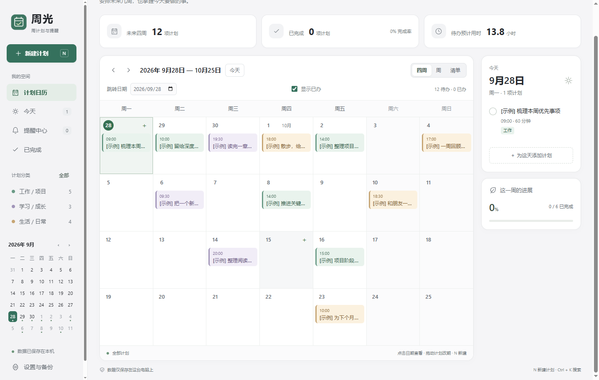
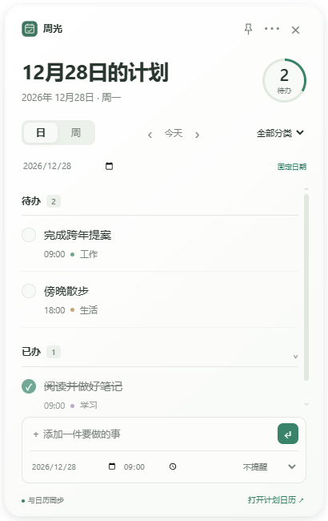

# 周光 Weeklight — Windows 日程管理、桌面待办与定时提醒

周光（Weeklight）是一款 **免费开源的 Windows 日程管理与时间管理软件**，将日历计划、待办事项（To-do List）、桌面便签和定时提醒放在一起。你可以在四周日历中规划未来几周，在周时间表中安排每天的时段，再用任务清单跟进学习、工作与生活中的计划。

桌面便签支持按日或按周查看待办与已办清单，可直接勾选完成、快速新增任务，并与主日历同步。便签默认位于其他窗口下方，也可以置顶；计划和设置保存在本机，支持离线使用，无需注册账号。

Weeklight is a free, open-source Windows calendar planner and to-do list app with desktop sticky notes, weekly planning, scheduled reminders, and offline local storage.

**Windows 10 / 11 · x64 · 本地保存 · MIT 开源**



## 下载与安装

**[下载 Windows 安装包（1.1.2，x64）](https://github.com/OrangeCatzhang/weeklight/releases/download/v1.1.2/Weeklight-Setup-1.1.2.exe)** · [全部版本与校验文件](https://github.com/OrangeCatzhang/weeklight/releases)

源码托管在 GitHub，安装 EXE 通过 GitHub Releases 公开分发，不进入源码仓库。

下载安装包后直接运行，按提示选择安装位置。终端用户无需安装 Node.js 或编译工具。安装版可创建桌面与开始菜单快捷方式，并可在设置中启用开机启动。

当前版本 **1.1.2**。安装包尚未使用商业代码签名证书；Windows 可能显示未知发布者。请核对下载来源和发布页提供的 SHA-256。

## 适合哪些使用场景

- **学习计划与备考安排**：把复习、阅读、作业和课程放进四周日历，用每周计划表安排学习时段。
- **工作日程与任务管理**：整理会议、项目节点和日常工作清单，拖动计划改期，及时跟进待办事项。
- **电脑桌面待办与便签**：在独立小窗口查看今天或本周的任务，直接勾选完成，需要持续查看时置顶。
- **桌面日历与周计划**：用主窗口的日历规划未来几周，用桌面周清单查看本周待办和已办，帮助安排下一周。
- **日程提醒与生活计划**：为课程、会议、运动和日常安排设置定时提醒，支持提前提醒和稍后 10 分钟提醒。

## 功能：日历计划、待办清单、桌面便签与提醒

- **未来几周的计划**：四周日历、周时间表、清单视图；分类、搜索、拖动改期和每周重复。
- **桌面便签**：选择日或周范围，同时显示待办与已办；直接勾选、快速新增，并与主日历同步。
- **底层与置顶**：便签默认在其他应用窗口下方；点击后可以输入，失去焦点后沉底；图钉可切换置顶。
- **提醒**：到点或提前提醒、托盘运行、弹窗、稍后 10 分钟提醒及恢复后补发。
- **本地数据**：无需账号；导出和导入 JSON 备份，保存时保留上一份数据副本。

## 使用

点击「新建计划」或按 **N**。单击日期查看当天计划，双击空白日期创建；点击已有计划编辑。**Ctrl+K** 搜索名称与备注。

从主窗口右上角「桌面便签」或托盘菜单打开便签。日 / 周按钮切换范围；箭头翻页，日期框跳转，「今天」恢复跟随当前日期。拖动顶部移动，拖动边缘调整大小；「⋯」调整颜色和已办显示。

关闭主窗口后，托盘和提醒继续运行。需要彻底停止时，在托盘选择「退出周光」，或使用设置中的退出按钮。关闭便签只隐藏便签。



### 运行边界

关机、休眠或应用退出期间不能即时提醒；再次运行或恢复后会补发仍未完成、尚未提醒的事项。Windows 通知权限和专注助手可能影响系统通知，独立提醒弹窗可在设置中控制。

便签是独立窗口，没有嵌入资源管理器桌面。**Win+D / 显示桌面可能把便签一起隐藏**，可从主窗口或托盘重新打开。待办与已办按计划日期分组，每周重复生成的事项独立编辑。

## 数据与隐私

默认使用 Electron 的当前用户应用数据目录；在 Windows 上通常位于 `%APPDATA%\weeklight`。实际路径可在「设置与备份」中查看或打开。数据文件为 `plans.json`，上一份保存副本为 `plans.json.bak`。升级应用通常保留此目录；卸载或迁移前建议导出备份。

可通过 `WEEKLIGHT_DATA_DIR` 环境变量指定其他目录。应用不会主动查找或迁移其他路径中的数据。早期测试版本用户可先从旧版导出 JSON，再在新版中导入。

应用没有账户服务、云同步或遥测。源码和公开安装包不包含个人计划、备份、浏览器缓存或本机验证报告。

## 从源码运行

需要 **Windows x64、Node.js 22.12 或更高版本、npm**；本项目使用 Node.js 24 验证。原生层级助手由系统的 .NET Framework C# 编译器构建（Windows 10 / 11 的 .NET Framework 4.x 环境）。

```powershell
git clone https://github.com/OrangeCatzhang/weeklight.git
cd weeklight
npm ci
npm start
```

`npm start` 会先编译原生助手。普通用户使用安装包即可。

### 验证与构建

```powershell
npm test
npm run test:widget
npm run test:layer
powershell -NoProfile -ExecutionPolicy Bypass -File scripts/build.ps1
npm run test:packaged
```

桌面测试需要可交互的 Windows 桌面，并使用独立测试数据。构建结果在 `outputs/weeklight-1.1.2/`：`Weeklight-Setup-1.1.2.exe` 为安装包，`win-unpacked/周光.exe` 可直接运行（需保留整个 `win-unpacked` 文件夹）。

`npm run test:ui` 提供额外的主日历回归验证。可选的 `scripts/prepare-runtime.cjs` 用于离线准备 Electron，需要 Python 和匹配校验值的官方 Electron ZIP；正常 `npm ci` 不需要运行它。

## 项目结构

- `src/main.cjs`：桌面窗口、托盘、数据与提醒。
- `src/core.cjs`、`src/data-path.cjs`：计划校验、提醒判定和数据目录。
- `src/renderer.js`、`src/style.css`：主日历界面。
- `src/widget-*`：桌面便签模型、窗口与界面。
- `src/native/WindowLayer.cs`：仅调整应用窗口层级的 Windows 原生助手。
- `tests/`：数据边界、交互、原生层级与打包验证。

## 开源与反馈

本项目代码按 [MIT 许可证](LICENSE) 开源。Electron、Chromium 及其他依赖遵循各自许可证；二进制发行保留随附的第三方许可文件。

欢迎通过 [Issues](https://github.com/OrangeCatzhang/weeklight/issues) 反馈问题。提交截图或日志前请移除个人计划内容。

界面组织参考 [TickTick](https://www.ticktick.com/windows)、[Notion Calendar](https://www.notion.com/product/calendar) 和 [Apple 界面指南](https://developer.apple.com/design/human-interface-guidelines/)，代码与页面为独立实现，与这些产品没有隶属关系。
